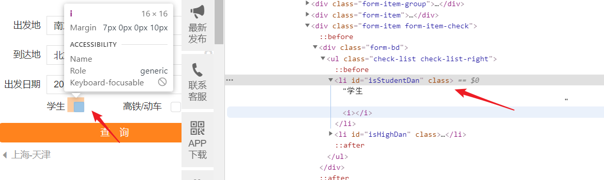
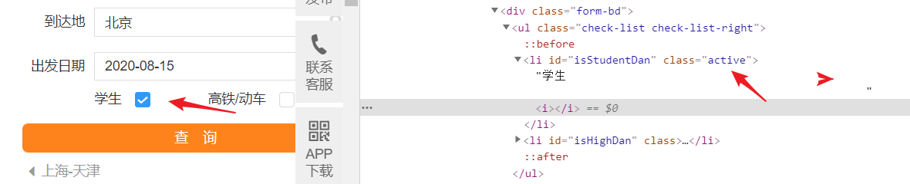
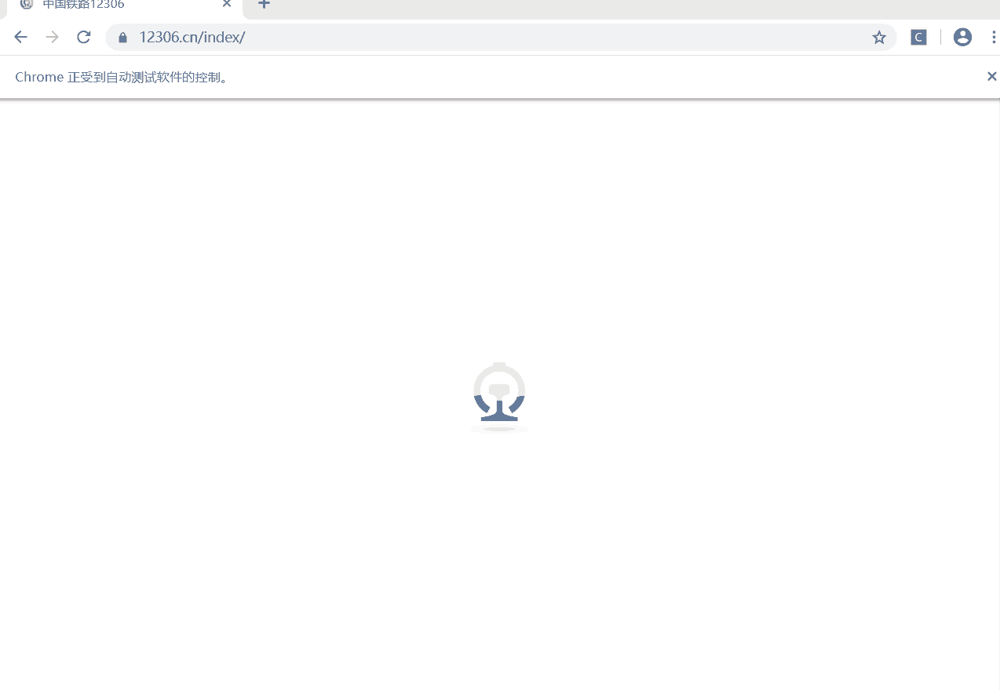

# selenium给元素的属性赋值

原帖：

我有一个WebElement，我想将其属性值重置为其他值（例如`attr`是该属性，并且我想将其原始`value=1`更改为新的`value=10`）。

可能吗？我正在使用Selenium 2.0（WebDriver。）

必须使用JavascriptExecutor类：

```html
WebDriver driver; // Assigned elsewhere
JavascriptExecutor js = (JavascriptExecutor) driver;
js.executeScript("document.getElementById('//id of element').setAttribute('attr', '10')");
```


爬虫的时候遇到了这样的情况；

用 `driver.execute_script()`这个方法来执行 js 语句, 改变属性的值，达到勾选的目的。

```python
js = "document.getElementById('isStudentDan').setAttribute('class', 'active')"
driver.execute_script(js)
```


## 特殊的单(复)选框

例如 12306 的复选框



标签没有 `type="checkbox"` 属性，而是通过改变 `class` 的值，来设置是否勾选：



解决方案：

用 `driver.execute_script()`这个方法来执行 js 语句, 改变属性的值，达到勾选的目的。

代码：

```python
from selenium import webdriver
import time
from selenium.webdriver.common.action_chains import ActionChains

driver = webdriver.Chrome()
url = "https://www.12306.cn/index/"
driver.get(url)
time.sleep(5)

# 设置出发地
s = driver.find_element_by_id('fromStationText')
ActionChains(driver).move_to_element(s) \
    .click(s) \
    .send_keys_to_element(s, "南京") \
    .move_by_offset(20, 50) \
    .click() \
    .perform()

# 设置目的地
t = driver.find_element_by_id('toStationText')
ActionChains(driver).move_to_element(t) \
    .click(t) \
    .send_keys_to_element(t, "北京") \
    .move_by_offset(20, 50) \
    .click() \
    .perform()


# 处理时间
# js 去掉 readonly 属性
js = 'document.getElementById("train_date").removeAttribute("readonly");'
driver.execute_script(js)

# js 添加时间
js_value = 'document.getElementById("train_date").value="2020-08-20"'
driver.execute_script(js_value)


js = "document.getElementById('isStudentDan').setAttribute('class', 'active')"
driver.execute_script(js)
```




参考

- <a href="https://www.it-swarm.dev/zh/testing/selenium：是否可以在selenium中设置webelement的任何属性值？/941081452/" target="_blank">Selenium：是否可以在Selenium中设置WebElement的任何属性值？</a>

  

